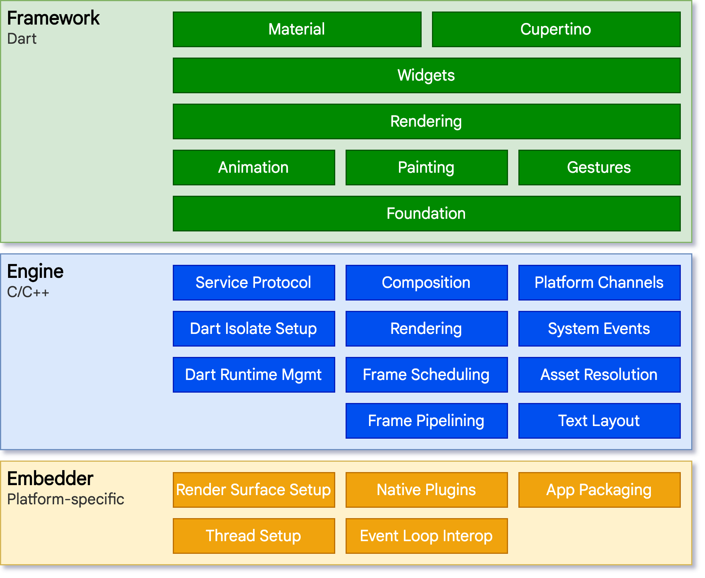
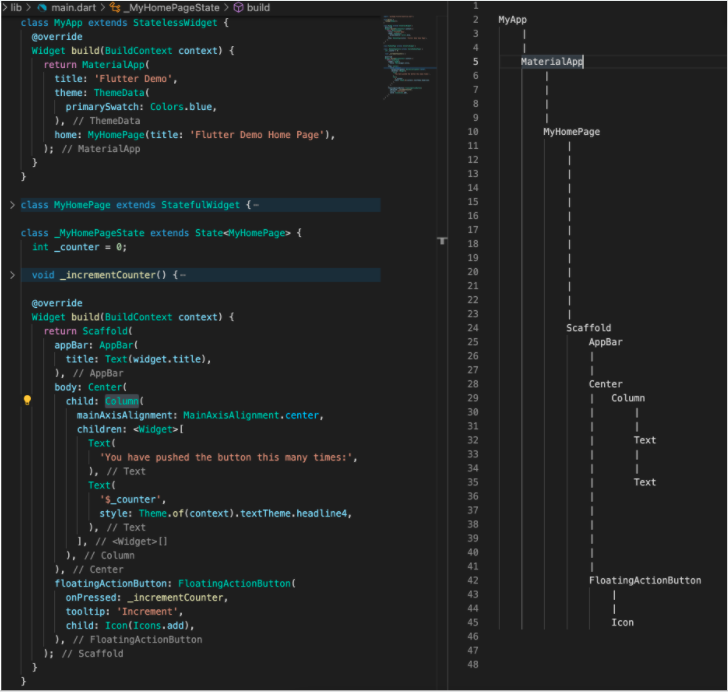
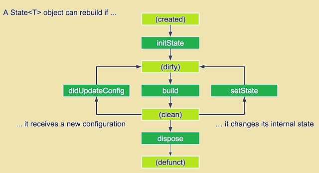
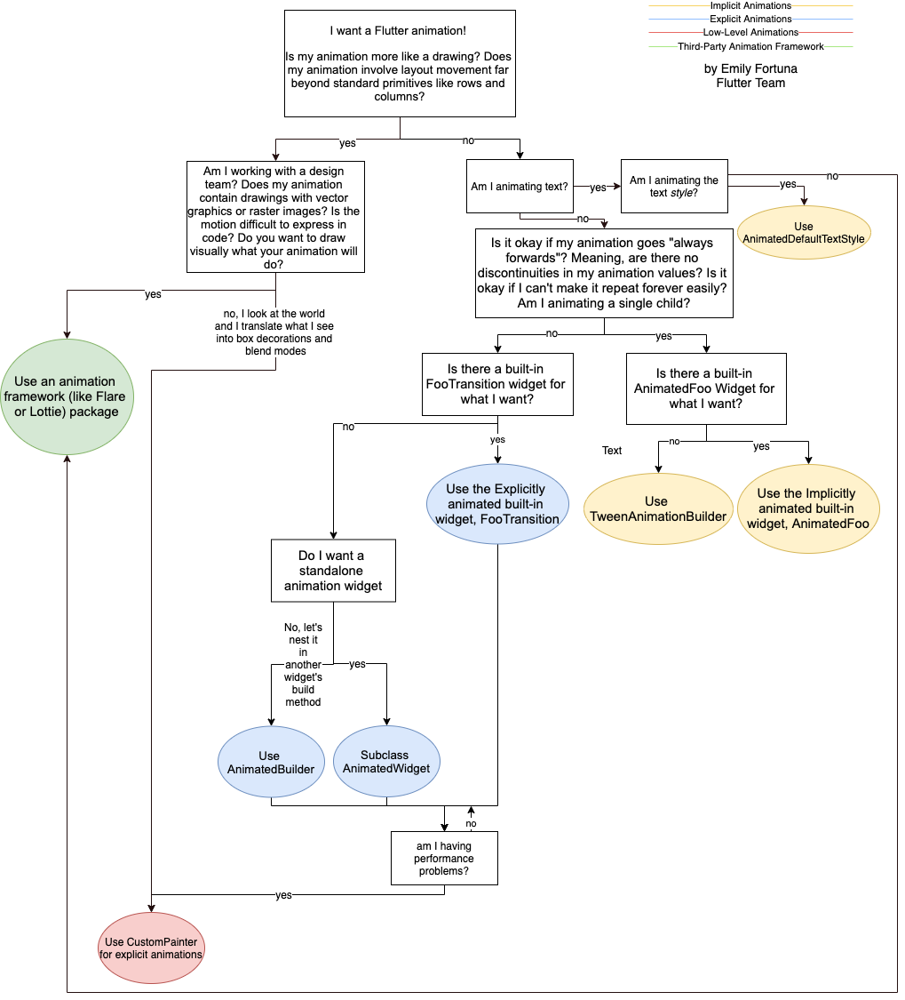

<!--
header: 'created by Lam Nguyen'
-->

# 

Made by **Google**

<!--
footer: ''
-->

---

## 1. What is **Flutter**?

**Flutter** is `Google's UI toolkit` for building beautiful, natively compiled applications for `mobile`, `web`, `desktop`, and `embedded` devices from a single codebase.

<!--
footer: 'https://flutter.dev/'
-->

---

<!--
header: '1. What is Flutter?'
-->

### 1.1. Architectural layers




<!--
footer: 'https://flutter.dev/docs/resources/architectural-overview'
-->

---

<!--
header: '1. What is Flutter?'
-->


<!--
footer: ''
-->

### 1.2. Get started

Get started now?
https://flutter.dev/docs/get-started/install


Coming from another platform?
Docs:
[iOS](https://flutter.dev/docs/get-started/flutter-for/ios-devs), [Android](https://flutter.dev/docs/get-started/flutter-for/android-devs), [Web](https://flutter.dev/docs/get-started/flutter-for/web-devs), [React Native](https://flutter.dev/docs/get-started/flutter-for/react-native-devs) and [Xamarin](https://flutter.dev/docs/get-started/flutter-for/xamarin-forms-devs).

<!--
footer: ''
-->

---

<!--
header: '1. What is Flutter?'
-->

### 1.3. Try Flutter in your browser


```dart
import "package:flutter/material.dart";

void main() {
  runApp(
    const Center(
      child: Text(
        "Hello World!!!",
        textDirection: TextDirection.ltr,
      ),
    ),
  );
}
```

<!--
footer: ''
-->

---

<!--
header: '1. What is Flutter?'
-->

### 1.3. Try Flutter in your browser

<iframe width="100%" height="500px" src="https://dartpad.dev/embed-flutter.html?theme=&amp;null_safety=true&id=9677a59dba30af792ba6d129b8a58f63"></iframe>

<!--
footer: 'https://dartpad.dev/embed-flutter.html?theme=&amp;null_safety=true&id=9677a59dba30af792ba6d129b8a58f63'
-->

---

### 1.4. Who's using Flutter?
Organizations around the world are building apps with Flutter.

| * | * | * |
| :-----------: | :-----------: | :-----------: |
|  |  |  |
|  |  |  |

<!--
footer: ''
-->

---

<!--
header: '1. What is Flutter?'
-->

### 1.4. Who's using Flutter?

See what’s being created:

<iframe width="100%" height="100%" src="https://flutter.dev/showcase"></iframe>

<!--
footer: 'https://flutter.dev/showcase'
-->

---

<!--
header: ''
-->

## 2. User Interface
+ 2.1. Introduction to widgets
+ 2.2. Building layouts
+ 2.3. Adding interactivity
+ 2.4. Assets & images
+ 2.5. Navigation & routing
+ 2.6. Animations
+ 2.7. Advanced UI
+ 2.8. Widget catalog

<!--
footer: ''
-->

---

<!--
header: '2. User Interface'
-->

### 2.1. Introduction to widgets

- Flutter `Widgets` are inspired by React `Components`
- Rendered by their current configuration (or BuildContext) and state
- When state changes, it rebuilds
- the framework diffs against the previous description in order to determine the minimal changes needed

<!--
footer: ''
-->

---

<!--
header: '2. User Interface'
-->

### 2.1. Introduction to widgets

- `Everything` is a `Widget`
  - But don’t put everything in one Widget!
- References:
  https://romain-rastel.medium.com/everything-is-a-widget-but-dont-put-everything-in-a-widget-32f89b5c8bdb
  
  
> Everything Should Be Made as Simple as Possible, But Not Simpler

<!--
footer: ''
-->

---

<!--
header: '2. User Interface'
-->

### 2.1. Introduction to widgets

#### Basic widgets:

- [Text](https://api.flutter.dev/flutter/widgets/Text-class.html) - create a run of styled text within your application.
- [Row](https://api.flutter.dev/flutter/widgets/Row-class.html), [Column](https://api.flutter.dev/flutter/widgets/Column-class.html) are flex widgets
- [Stack](https://api.flutter.dev/flutter/widgets/Stack-class.html) - place widgets on top of each other in paint order.
- [Container](https://api.flutter.dev/flutter/widgets/Container-class.html) - create a rectangular visual element, decorated with a background, a border, or a shadow; also have margins, padding, and constraints applied to its size, ...

… more widgets from there: https://api.flutter.dev/flutter/widgets/widgets-library.html

<!--
footer: ''
-->

---

<!--
header: '2. User Interface'
-->

### 2.1. Introduction to widgets

#### Notion of Widgets tree

Widgets are organized in tree structure(s).



<!--
footer: ''
-->

---

<!--
header: '2. User Interface'
-->

### 2.1. Introduction to widgets

#### Notion of Context or BuildContext

Location of a Widget within the tree structure
A context only belongs to one widget.


<!--
footer: 'https://www.didierboelens.com/2018/06/widget-state-context-inheritedwidget/'
-->

---

<!--
header: '2. User Interface'
-->

### 2.1. Introduction to widgets

#### Stateful and stateless widgets (1)

| StatelessWidget | StatefulWidget |
| ----- | ----- |
| Examples:<br/> - [Icon](https://api.flutter.dev/flutter/widgets/Icon-class.html)<br/> - [IconButton](https://api.flutter.dev/flutter/material/IconButton-class.html)<br/> - [Text](https://api.flutter.dev/flutter/widgets/Text-class.html) | Examples:<br/> - [Checkbox](https://api.flutter.dev/flutter/material/Checkbox-class.html)<br/> - [Radio](https://api.flutter.dev/flutter/material/IconButton-class.html)<br/> - [Slider](https://api.flutter.dev/flutter/material/Text-class.html)<br/> - [InkWell](https://api.flutter.dev/flutter/material/Text-class.html)<br/> - [Form](https://api.flutter.dev/flutter/widgets/Text-class.html)<br/> - [TextField](https://api.flutter.dev/flutter/material/Text-class.html)|
| Super-class: [StatelessWidget](https://api.flutter.dev/flutter/widgets/StatelessWidget-class.html) | Super-class: [StatefulWidget](https://api.flutter.dev/flutter/widgets/StatefulWidget-class.html) |

<!--
footer: ''
-->


---

<!--
header: '2. User Interface'
-->

### 2.1. Introduction to widgets

#### Stateful and stateless widgets (2)

| StatelessWidget | StatefulWidget |
| ----- | ----- |
| Not have to care the state | There are some inner data held and may vary during the lifetime of this widget - called a State |

<!--
footer: ''
-->


---

<!--
header: '2. User Interface'
-->

### 2.1. Introduction to widgets

#### Widget’s Lifecycle (1)


<!--
footer: ''
-->


---

<!--
header: '2. User Interface'
-->

### 2.1. Introduction to widgets

#### Widget’s Lifecycle (2)

The life cycle of the StatefulWidget




<!--
footer: 'https://www.developerlibs.com/2019/12/flutter-lifecycle-widgets.html'
-->

---

<!--
header: '2. User Interface'
-->

### 2.1. Introduction to widgets

#### Notion of State

A State defines the `behavioural` part of a StatefulWidget instance.

It holds information aimed at interacting / interferring with the Widget in terms of:
- behaviour
- layout

> Any changes which is applied to a State forces the Widget to rebuild.

<!--
footer: ''
-->

---

<!--
header: '2. User Interface'
-->

### 2.1. Introduction to widgets

#### Relation between a State and a Context

For Stateful widgets, a `State` is associated with a `Context`. This association is permanent and the `State` object will never change its context.

Even if the Widget Context can be moved around the tree structure, the State will remain associated with that context.

When a State is associated with a Context, the State is considered as mounted.

<!--
footer: ''
-->

---

<!--
header: '2. User Interface'
-->

### 2.1. Introduction to widgets

#### Standard Code of A StatelessWidget

<iframe width="100%" height="500px" src="https://dartpad.dev/embed-flutter.html?theme=&amp;null_safety=true&id=e84496279c4f535c42613d827029aad4"></iframe>

<!--
footer: 'https://dartpad.dev/embed-flutter.html?theme=&amp;null_safety=true&id=e84496279c4f535c42613d827029aad4'
-->

---

<!--
header: '2. User Interface'
-->

### 2.1. Introduction to widgets

#### Standard Code of A StatefulWidget

<iframe width="100%" height="500px" src="https://dartpad.dev/embed-flutter.html?theme=&amp;null_safety=true&id=48be1c817d6f84f1cb39f06975bccfc5"></iframe>

<!--
footer: 'https://dartpad.dev/embed-flutter.html?theme=&amp;null_safety=true&id=48be1c817d6f84f1cb39f06975bccfc5'
-->

---

<!--
header: '2. User Interface'
-->

### 2.1. Introduction to widgets

#### Keys

- Use `keys` to control which widgets are `rebuilds`
- For example in builds a list items in ListView:
  - Without `keys`, the item is rebuilt even if it is no longer visible in viewport.
  - By assigning each entry in the list a “semantic” key, only the items visible in the view will be rebuilds.

For more information, see the [Key](https://api.flutter.dev/flutter/widgets/Key-class.html) API.

<!--
footer: ''
-->

---

<!--
header: '2. User Interface'
-->

### 2.1. Introduction to widgets

#### Global keys

- To uniquely identify child widgets.
- Must be globally unique across the entire widget hierarchy.
- Can be used to retrieve the state associated with a widget.

For more information, see the [GlobalKey](https://api.flutter.dev/flutter/widgets/GlobalKey-class.html) API.

<!--
footer: ''
-->

---

<!--
header: '2. User Interface'
-->

### 2.2. Building layouts

- Layouts in Flutter
- Tutorial
- Creating adaptive and responsive apps
- Understanding constraints
- Box constraints


<!--
footer: ''
-->

---

<!--
header: '2. User Interface / 2.2. Building layouts'
-->

#### 2.2.1 Layouts in Flutter

#### Example (1)

| Design | Visual Layout |
| ----- | ----- |
|  |  |

<!--
footer: 'https://flutter.dev/docs/development/ui/layout'
-->

---

<!--
header: '2. User Interface / 2.2. Building layouts'
-->

#### 2.2.1 Layouts in Flutter

##### Example (2)

Widgets Tree


<!--
footer: 'https://flutter.dev/docs/development/ui/layout'
-->

---

<!--
header: '2. User Interface / 2.2. Building layouts'
-->

#### 2.2.1 Layouts in Flutter

##### Design Languages libaries built-in:
- [Material](https://api.flutter.dev/flutter/material/material-library.html) - Google Material Design
- [Cupertino](https://api.flutter.dev/flutter/cupertino/cupertino-library.html) - iOS Design Language

<!--
footer: ''
-->

---

<!--
header: '2. User Interface / 2.2. Building layouts'
-->

#### 2.2.1 Layouts in Flutter

##### Common layout widgets:

Standard widgets

- [Container](https://flutter.dev/docs/development/ui/layout#container): Adds padding, margins, borders, background color, or other decorations to a widget.
- [GridView](https://flutter.dev/docs/development/ui/layout#gridView): Lays widgets out as a scrollable grid.
- [ListView](https://flutter.dev/docs/development/ui/layout#listView): Lays widgets out as a scrollable list.
- [Stack](https://flutter.dev/docs/development/ui/layout#stack): Overlaps a widget on top of another.

<!--
footer: 'https://flutter.dev/docs/development/ui/layout#common-layout-widgets'
-->

---

<!--
header: '2. User Interface / 2.2. Building layouts'
-->

#### 2.2.1 Layouts in Flutter

##### Common layout widgets:

Material widgets
- [Card](https://flutter.dev/docs/development/ui/layout#card): Organizes related info into a box with rounded corners and a drop shadow.
- [ListTile](https://flutter.dev/docs/development/ui/layout#listtile): Organizes up to 3 lines of text, and optional leading and trailing icons, into a row.

<!--
footer: 'https://flutter.dev/docs/development/ui/layout#common-layout-widgets'
-->

---

<!--
header: '2. User Interface / 2.2. Building layouts'
-->

#### 2.2.2 Tutorial

<iframe width="100%" height="500px" src="https://flutter.dev/docs/development/ui/layout/tutorial"></iframe>

<!--
footer: 'https://flutter.dev/docs/development/ui/layout/tutorial'
-->

---

<!--
header: '2. User Interface / 2.2. Building layouts'
-->

#### 2.2.3 Creating adaptive and responsive apps

Difference between Adaptive and Responsive app
- Adaptive and responsive can be viewed as separate dimensions of an app
- Responsive
  - Typically, a responsive app has had its layout tuned for the available screen size...
  - [Create a responsive app](https://flutter.dev/docs/development/ui/layout/adaptive-responsive#creating-a-responsive-flutter-app)
- Adaptive
  - Adapting an app to run on different device types, such as mobile and desktop, requires dealing with mouse and keyboard input, ...
  - [Building adaptive apps](https://flutter.dev/docs/development/ui/layout/building-adaptive-apps)


<!--
footer: 'https://flutter.dev/docs/development/ui/layout/adaptive-responsive'
-->

---

<!--
header: '2. User Interface / 2.2. Building layouts'
-->

#### 2.2.3 Understanding constraints
<iframe width="100%" height="500px" src="https://flutter.dev/docs/development/ui/layout/constraints"></iframe>

<!--
footer: 'https://flutter.dev/docs/development/ui/layout/constraints'
-->

---

<!--
header: '2. User Interface'
-->

### 2.3. Adding interactivity
<iframe width="100%" height="500px" src="https://flutter.dev/docs/development/ui/interactive"></iframe>

<!--
footer: 'https://flutter.dev/docs/development/ui/interactive'
-->

---

<!--
header: '2. User Interface'
-->

### 2.4. Adding assets and images
<iframe width="100%" height="500px" src="https://flutter.dev/docs/development/ui/assets-and-images"></iframe>

<!--
footer: 'https://flutter.dev/docs/development/ui/assets-and-images'
-->

---

<!--
header: '2. User Interface'
-->

### 2.5. Navigation and routing (1)

Two approaches:
- Imperative approach, Navigation v1.0
  - see the [Navigation recipes](https://flutter.dev/docs/cookbook/navigation)
  - Or using [Fluro](https://pub.dev/packages/fluro) package
- Declarative approach, Navigation v2.0
  - [Learning Flutter’s new navigation and routing system](https://medium.com/flutter/learning-flutters-new-navigation-and-routing-system-7c9068155ade)
  - Alternate packages:
    - [vrouter](https://pub.dev/packages/vrouter)
    - [beamer](https://pub.dev/packages/beamer) (not stable)

<!--
footer: 'https://flutter.dev/docs/development/ui/layout/adaptive-responsive'
-->

---

<!--
header: '2. User Interface'
-->

### 2.5. Navigation and routing (2)

**Deep linking**:
- Examples:
  - `http://flutterbooksample.com/book/1`
  - `customscheme://flutterbooksample.com/book/1`

**URL strategy on the web**
- Hash (default)
For example, `flutterexample.dev/#/path/to/screen`.
- Path
For example, `flutterexample.dev/path/to/screen`.

<!--
footer: 'https://flutter.dev/docs/development/ui/layout/adaptive-responsive'
-->

---

<!--
header: '2. User Interface'
-->

### 2.5. Navigation and routing (3)

#### [Fluro](https://pub.dev/packages/fluro)
- Simple route navigation
- Function handlers (map to a function instead of a route)
- Wildcard parameter matching
- Querystring parameter parsing
- Common transitions built-in
- Simple custom transition creation
- Follows stable Flutter channel
- Null-safety


<!--
footer: 'https://pub.dev/packages/fluro'
-->

---

<!--
header: '2. User Interface'
-->

### 2.5. Navigation and routing (4)

#### [VRouter](https://pub.dev/packages/vrouter) (for reference only)
- Automated web url handling
- Nesting routes
- Transition
- Advanced url naming
- Reacting to route changing
- Customizable pop events
- And much more...

<!--
footer: 'https://pub.dev/packages/vrouter'
-->

---

<!--
header: '2. User Interface'
-->

### 2.6. Animations

**Approaches:**
- [Implicit Animations](https://flutter.dev/docs/development/ui/animations/implicit-animations)
- [Explicit Animations](https://flutter.dev/docs/codelabs/explicit-animations)
- Low-Level Animation
  - draw it with canvas via [CustomPainter](https://api.flutter.dev/flutter/rendering/CustomPainter-class.html)
- Third-party animation framework
  - [flare_flutter](https://pub.dev/packages/flare_flutter)
  - [lottie](https://pub.dev/packages/lottie)

<!--
footer: 'https://flutter.dev/docs/development/ui/animations#choosing-an-approach'
-->

---

<!--
header: '2. User Interface'
-->

### 2.6. Animations



Full picture: [Click here](https://flutter.dev/assets/images/docs/ui/animations/animation-decision-tree.png)
Video: [How to choose which Flutter Animation Widget is right for you?](https://www.youtube.com/watch?v=GXIJJkq_H8g)


<!--
footer: 'https://flutter.dev/docs/development/ui/animations#choosing-an-approach'
-->

---

<!--
header: '2. User Interface'
-->

### 2.6. Animations

[Common animation patterns](https://flutter.dev/docs/development/ui/animations#common-animation-patterns)
- Animated list or grid
- Shared element transition
  - Shared element transitions between routes (pages)
  - [Hero animations](https://flutter.dev/docs/development/ui/animations/hero-animations)
- [Staggered animation](https://flutter.dev/docs/development/ui/animations/staggered-animations)
  - Animations that are broken into smaller motions, where some of the motion is delayed.
  - The smaller animations might be sequential, or might partially or completely overlap.

<!--
footer: 'https://flutter.dev/docs/development/ui/animations#choosing-an-approach'
-->

---

<!--
header: '2. User Interface'
-->

### 2.7. Advanced UI

- Using Actions and Shortcuts
- Gestures
- Slivers
- Splash screens

<!--
footer: ''
-->

---

<!--
header: '2. User Interface'
-->

### 2.8. Widget catalog


<iframe width="100%" height="500px" src="https://flutter.dev/docs/development/ui/widgets"></iframe>

<!--
footer: 'https://flutter.dev/docs/development/ui/widgets'
-->

---

<!--
header: ''
-->

## 3. State management
- 3.1. [Introduction](https://flutter.dev/docs/development/data-and-backend/state-mgmt/intro)
- 3.2. [Think declaratively](https://flutter.dev/docs/development/data-and-backend/state-mgmt/declarative)
- 3.3. [Ephemeral vs app state](https://flutter.dev/docs/development/data-and-backend/state-mgmt/ephemeral-vs-app)
- 3.4. [Simple app state management](https://flutter.dev/docs/development/data-and-backend/state-mgmt/simple)
- 3.5. [Options](https://flutter.dev/docs/development/data-and-backend/state-mgmt/options)
- 3.6. [Riverpod](https://riverpod.dev/)

<!--
footer: ''
-->

---

<!--
header: '3. State management'
-->

## 3.6 Riverpod

> Welcome to Riverpod!

Website: [riverpod.dev](https://riverpod.dev)

Table of Contents:
- 3.6.1. Introduction
- 3.6.2. Providers
- 3.6.3. Creating a provider
- 3.6.3. Reading a provider
- 3.6.4. Combining providers
- 3.6.5. ProviderObserver
- 3.6.6. Modifiers

<!--
footer: ''
-->

---

<!--
header: '3. State management / 3.6 Riverpod'
-->

### 3.6.1 Introduction

> Riverpod

A Reactive State-Management and Dependency Injection framework.

Packages:
| riverpod         | [](https://pub.dartlang.org/packages/riverpod)                 |
| ---------------- | ------------------------------------------------------------------------------------------------------------------------------------------------- |
| flutter_riverpod | [](https://pub.dartlang.org/packages/flutter_riverpod) |
| hooks_riverpod   | [](https://pub.dartlang.org/packages/hooks_riverpod)     |

<!--
footer: 'https://riverpod.dev/'
-->

---

<!--
header: '3. State management / 3.6 Riverpod'
-->

### 3.6.2 Providers

Providers are the most important part of a `Riverpod` application.
A provider is an object that encapsulates a piece of state and allows listening to that state.

For providers to work, you must add `ProviderScope` at the root of your Flutter applications:
```dart
void main() {
  runApp(
    ProviderScope(
      child: const MyApp(),
    )
  );
}

```

<!--
footer: 'https://riverpod.dev/docs/concepts/providers'
-->

---

<!--
header: '3. State management / 3.6 Riverpod'
-->

### 3.6.2 Providers

#### Why use providers? (1)

By wrapping a piece of state in a provider, this:
- Allows easily accessing that state in multiple locations.
  - Providers are a complete replacement for patterns like `Singletons`, `Service Locators`, `Dependency Injection` or `InheritedWidgets`.
- Simplifies combining this state with others.
  - Ever struggled to merge multiple objects into one?
    - This scenario is built directly inside providers, with a simple syntax.

<!--
footer: 'https://riverpod.dev/docs/concepts/providers#why-use-providers'
-->

---

<!--
header: '3. State management / 3.6 Riverpod'
-->

### 3.6.2 Providers

#### Why use providers? (2)

By wrapping a piece of state in a provider, this:
- Enables performance optimizations.
  - Whether for filtering widget rebuilds or for caching expensive state computations;
    - providers ensure that only what is impacted by a state change is recomputed.
- Increases the testability of your application.
  - With providers, you do not need complex setUp/tearDown steps.
  - Furthermore, any provider can be overridden to behave differently during test, which allows easily testing a very specific behavior.
- Easily integrate with advanced features, such as logging or pull-to-refresh.

<!--
footer: 'https://riverpod.dev/docs/concepts/providers#why-use-providers'
-->

---

<!--
header: '3. State management / 3.6 Riverpod'
-->

### 3.6.3 Creating a Provider (1)

#### Providers come in many variants, but they all work the same way.

```dart
final myProvider = Provider<MyValue>(
  (ref) {
    return MyValue();
  },
  name: 'myProvider', // name used in debug
);
```

we can have two providers expose a state of the same "type":
```dart
final cityProvider = Provider<String>((ref) => 'London');
final countryProvider = Provider<String>((ref) => 'England');
```

<!--
footer: 'https://riverpod.dev/docs/concepts/providers#creating-a-provider'
-->

---

<!--
header: '3. State management / 3.6 Riverpod'
-->

### 3.6.3 Creating a Provider (2)

#### Performing actions before the state destruction

```dart
final example = StreamProvider.autoDispose((ref) {
  final streamController = StreamController<int>();

  ref.onDispose(() {
    // Closes the StreamController when the state of this provider is destroyed.
    streamController.close();
  });

  return streamController.stream;
});
```

> Note: Depending on the provider used, it may already take care of the clean-up process. For example, `StateNotifierProvider` will call the dispose method of a `StateNotifier`.

<!--
footer: 'https://riverpod.dev/docs/concepts/providers#performing-actions-before-the-state-destruction'
-->

---

<!--
header: '3. State management / 3.6 Riverpod'
-->

### 3.6.3 Creating a Provider (3)

#### Creating Provider with Modifiers

```dart
final myAutoDisposeProvider = StateProvider.autoDispose<String>((ref) => 0);
final myFamilyProvider = Provider.family<String, int>((ref, id) => '$id');

// combine 2 modifiers (autoDispose & family)
final userProvider = FutureProvider.autoDispose.family<User, int>((ref, userId) async {
  return fetchUser(userId);
});
```
At the moment, there are two modifiers available:
- `.autoDispose`, which will make the provider automatically destroy its state when it is no-longer listened.
- `.family`, which allows creating a provider from external parameters.

<!--
footer: 'https://riverpod.dev/docs/concepts/providers#provider-modifiers'
-->

---

<!--
header: '3. State management / 3.6 Riverpod'
-->

### 3.6.3 Reading a Provider (1)

#### Obtaining a "ref" object
First and foremost, before reading a provider, we need to obtain a "ref" object.

This object is what allows us to interact with providers, be it from a widget or another provider.

<!--
footer: 'https://riverpod.dev/docs/concepts/reading#obtaining-a-ref-object'
-->

---

<!--
header: '3. State management / 3.6 Riverpod'
-->

### 3.6.3 Reading a Provider (2)

#### Obtaining a "ref" from a provider

All providers receive a "ref" as parameter:

```dart
final provider = Provider((ref) {
  // use ref to obtain other providers
  final repository = ref.watch(repositoryProvider);

  return SomeValue(repository);
})
```

<!--
footer: 'https://riverpod.dev/docs/concepts/reading#obtaining-a-ref-from-a-provider'
-->

---

<!--
header: '3. State management / 3.6 Riverpod'
-->

### 3.6.3 Reading a Provider (3)

(Obtaining a "ref" from a provider)

This parameter is safe to pass to the value exposed by the provider.

```dart
final counter = StateNotifierProvider<Counter, int>((ref) {
  return Counter(ref);
});

class Counter extends StateNotifier<int> {
  Counter(this.ref): super(0);

  final ProviderRefBase ref;

  void increment() {
    // Counter can use the "ref" to read other providers
    final repository = ref.read(repositoryProvider);
    repository.post('...');
  }
}
```

<!--
footer: 'https://riverpod.dev/docs/concepts/reading#obtaining-a-ref-from-a-provider'
-->

---

<!--
header: '3. State management / 3.6 Riverpod'
-->

### 3.6.3 Reading a Provider (4)

#### Obtaining a "ref" from a widget

> When a widget obtains a "ref", this "ref" should not be passed around. It should be used only by the widget that created this object.

Extending `ConsumerWidget` instead of `StatelessWidget`

```dart
class HomeView extends ConsumerWidget {
  const HomeView({Key? key}): super(key: key);

  @override
  Widget build(BuildContext context, WidgetRef ref) {
    // use ref to listen to a provider
    final counter = ref.watch(counterProvider);
    return Text('$counter');
  }
}
```

<!--
footer: 'https://riverpod.dev/docs/concepts/reading#obtaining-a-ref-from-a-widget'
-->

---

<!--
header: '3. State management / 3.6 Riverpod'
-->

### 3.6.3 Reading a Provider (5)

```dart
class HomeView extends ConsumerStatefulWidget {
  const HomeView({Key? key}): super(key: key);
  @override
  HomeViewState createState() => HomeViewState();
}

class HomeViewState extends ConsumerState<HomeView> {
  @override
  void initState() {
    super.initState();
    // "ref" can be used in all life-cycles of a StatefulWidget.
    ref.read(counterProvider);
  }
  @override
  Widget build(BuildContext context) {
    // We can also use "ref" to listen to a provider inside the build method
    final counter = ref.watch(counterProvider);
    return Text('$counter');
  }
}
```

<!--
footer: 'https://riverpod.dev/docs/concepts/reading#obtaining-a-ref-from-a-widget'
-->

---

<!--
header: '3. State management / 3.6 Riverpod'
-->

### 3.6.3 Reading a Provider (6)

A final solution for obtaining a "ref" inside widgets is to rely on `Consumer`.

```dart
Scaffold(
  body: Consumer(
    builder: (context, ref, child) {
      // We can also use the ref parameter to listen to providers.
      final counter = ref.watch(counterProvider);
      return Text('$counter');
    },
  ),
)
```

<!--
footer: 'https://riverpod.dev/docs/concepts/reading#consumer-and-hookconsumer-widgets'
-->

---

<!--
header: '3. State management / 3.6 Riverpod'
-->

### 3.6.3 Reading a Provider (7)

#### Three primary usages for "ref":
- ref.watch
- ref.listen
- ref.read

> Whenever possible, prefer using `ref.watch` over `ref.read` or `ref.listen` to implement a feature.
By changing your implementation to rely on `ref.watch`, it becomes both reactive and declarative, which makes your application more maintainable.

<!--
footer: 'https://riverpod.dev/docs/concepts/reading#using-ref-to-interact-with-providers'
-->

---

<!--
header: '3. State management / 3.6 Riverpod'
-->

### 3.6.3 Reading a Provider (8)

##### Using ref.watch to observe a provider

- inside the build method of a widget
- inside the body of a provider to have the widget/provider listen to provider

```dart
final filterTypeProvider = StateProvider<FilterType>((ref) => FilterType.none);
final todosProvider = StateNotifierProvider<TodoList, List<Todo>>((ref) => TodoList());

final filteredTodoListProvider = Provider((ref) {
  // obtains both the filter and the list of todos
  final FilterType filter = ref.watch(filterTypeProvider).state;
  final List<Todo> todos = ref.watch(todosProvider);
  switch (filter) {
    case FilterType.completed:
      // return the completed list of todos
      return todos.where((todo) => todo.isCompleted).toList();
    ...
  }
});
```

<!--
footer: 'https://riverpod.dev/docs/concepts/reading#using-refwatch-to-observe-a-provider'
-->

---

<!--
header: '3. State management / 3.6 Riverpod'
-->

### 3.6.3 Reading a Provider (9)

##### Using ref.listen to react to a provider change

Similarly to `ref.watch`, it is possible to use `ref.listen` to observe a provider.

The main difference between them is that, rather than rebuilding the widget/provider if the listened provider changes, using `ref.listen` will instead call a custom function.

That can be useful to perform actions when a certain change happens, such that to show a snackbar when an error happens.

<!--
footer: 'https://riverpod.dev/docs/concepts/reading#using-refwatch-to-observe-a-provider'
-->

---

<!--
header: '3. State management / 3.6 Riverpod'
-->

### 3.6.3 Reading a Provider (10)

##### Using ref.listen to react to a provider change

Used inside body of a provider:

```dart
final counterProvider = StateNotifierProvider<Counter, int>((ref) => Counter());

final anotherProvider = Provider((ref) {
  ref.listen<int>(counterProvider, (int count) {
    print('The counter changed ${count}');
  });
  ...
});
```


<!--
footer: 'https://riverpod.dev/docs/concepts/reading#using-reflisten-to-react-to-a-provider-change'
-->

---

<!--
header: '3. State management / 3.6 Riverpod'
-->

### 3.6.3 Reading a Provider (11)

##### Using ref.listen to react to a provider change

Inside the build method of a widget:

```dart
final counterProvider = StateNotifierProvider<Counter, int>((ref) => Counter());

class HomeView extends ConsumerWidget {
  const HomeView({Key? key}): super(key: key);

  @override
  Widget build(BuildContext context, WidgetRef ref) {
    ref.listen<int>(counterProvider, (int count) {
      print('The counter changed ${count}');
    });
    ...
  }
}
```


<!--
footer: 'https://riverpod.dev/docs/concepts/reading#using-reflisten-to-react-to-a-provider-change'
-->

---

<!--
header: '3. State management / 3.6 Riverpod'
-->

### 3.6.3 Reading a Provider (12)

##### Using ref.read to obtain the state of a provider once

The `ref.read` method is a way to obtain the state of a provider, without any extra effect.

It is commonly used inside functions triggered on user intereactions.

```dart
final counterProvider = StateNotifierProvider<Counter, int>((ref) => Counter());
class HomeView extends ConsumerWidget {
  ...
  @override
  Widget build(BuildContext context, WidgetRef ref) {
    return Scaffold(
      floatingActionButton: FloatingActionButton(
        onPressed: () {
          // Call `increment()` on the `Counter` class
          ref.read(counterProvider.notifier).increment();
        },
  ...
}
```

<!--
footer: 'https://riverpod.dev/docs/concepts/reading/#using-refread-to-obtain-the-state-of-a-provider-once'
-->

---

<!--
header: '3. State management / 3.6 Riverpod'
-->

### 3.6.3 Reading a Provider (13)

#### Notes

- The watch method should not be called asynchronously, like inside `onPressed` or a `ElevatedButton`. Not should it be used inside initState and other State life-cycles.
In those cases, consider using `ref.read` instead.
- The listen method should not be called asynchronously, like inside `onPressed` or a `ElevatedButton`. Not should it be used inside initState and other State life-cycles.
- Using `ref.read` should be avoided as much as possible.
It exists as a work-around for cases where using watch or listen would be otherwise too inconvenient to use.
If you can, it is almost always better to use watch/listen, especially watch.

<!--
footer: 'https://riverpod.dev/docs/concepts/reading/#using-refread-to-obtain-the-state-of-a-provider-once'
-->

---

<!--
header: '3. State management / 3.6 Riverpod'
-->

### 3.6.3 Reading a Provider (14)

#### Notes

- DON'T use ref.read inside the build method or provider
- You might be tempted to use ref.read to optimize the performance of a widget by doing:
```dart
  // BAD
  final counter = ref.read(counterProvider);

  // GOOD
  StateController<int> counter = ref.watch(counterProvider.notifier);

  return ElevatedButton(
    onPressed: () => counter.state++,
  );
```

<!--
footer: 'https://riverpod.dev/docs/concepts/reading/#using-refread-to-obtain-the-state-of-a-provider-once'
-->

---

<!--
header: '3. State management / 3.6 Riverpod'
-->

### 3.6.3 Reading a Provider (15)

#### Notes

On the other hand, the second approach supports cases where the counter is reset.
For example, another part of the application could call:
```dart
  ref.refresh(counterProvider);
```

which would recreate the `StateController` object.

If we used `ref.read` here, our button would still use the previous `StateController` instance, which was disposed and should no-longer be used.
Whereas using `ref.watch` correctly rebuilt the button to use the new `StateController`.

<!--
footer: 'https://riverpod.dev/docs/concepts/reading/#using-refread-to-obtain-the-state-of-a-provider-once'
-->

---

<!--
header: '3. State management / 3.6 Riverpod'
-->

### 3.6.3 Reading a Provider (16)

#### Deciding what to read

As example, consider the following StreamProvider:
```dart
  final userProvider = StreamProvider<User>(...);
```

When reading this userProvider, you can:

- synchronously read the current state by listening to userProvider itself
- obtain the associated Stream, by listening to userProvider.stream
- obtain a Future that resolves with the latest value emitted, by listening to userProvider.last


<!--
footer: 'https://riverpod.dev/docs/concepts/reading/#deciding-what-to-read'
-->

---

<!--
header: '3. State management / 3.6 Riverpod'
-->

### 3.6.3 Reading a Provider (17)

#### Using "select" to filter rebuilds

By default, listening to a provider listens to the entire object. But in some cases, a widget/provider may only case about some properties instead of the whole object.

For example, a provider may expose a User:
```dart
abstract class User {
  String get name;
  int get age;
}
```
But a widget may only use the user name:
```dart
  User name = ref.watch(userProvider).user; // NOT GOOD
  String name = ref.watch(userProvider.select((user) => user.name)); // GOOD
```

<!--
footer: 'https://riverpod.dev/docs/concepts/reading#using-select-to-filter-rebuilds'
-->

---

<!--
header: '3. State management / 3.6 Riverpod'
-->

### 3.6.3 Reading a Provider (18)

#### Using "select" to filter rebuilds

It is possible to use select with ref.listen too:
```dart
ref.listen<String>(
  userProvider.select((user) => user.name),
  (String name) {
    print('The user name changed $name');
  ...
```
Doing so will call the listener only when the name changes.

You don't have to return a property of the object. Any value that overrides == will work. For example you could do:
```dart
final label = ref.watch(userProvider.select((user) => 'Mr ${user.name}'));
```
<!--
footer: 'https://riverpod.dev/docs/concepts/reading#using-select-to-filter-rebuilds'
-->

---

<!--
header: '3. State management / 3.6 Riverpod'
-->

### 3.6.4. Combining providers

As an example, consider the following provider:
```dart
final cityProvider = Provider((ref) => 'London');
```
We can now create another provider that will consume our cityProvider:
```dart
final weatherProvider = FutureProvider((ref) async {
  // We use `ref.watch` to listen to another provider, and we pass it the provider
  // that we want to consume. Here: cityProvider
  final city = ref.watch(cityProvider);

  // We can then use the result to do something based on the value of `cityProvider`.
  return fetchWeather(city: city);
});
```
That's it. We've created a provider that depends on another provider.

<!--
footer: 'https://riverpod.dev/docs/concepts/combining_providers#combining-providers'
-->

---

<!--
header: '3. State management / 3.6 Riverpod'
-->

### 3.6.4. Combining providers

FAQ:
- What if the value listened changes over time?
- Can I read a provider without listening to it?
- How to test an object that receives read as parameter of its constructor?
- My provider updates too often, what can I do?

<!--
footer: 'https://riverpod.dev/docs/concepts/combining_providers#combining-providers'
-->

---

<!--
header: '3. State management / 3.6 Riverpod'
-->

### 3.6.5. ProviderObserver

Listens to the changes of a ProviderContainer.
Has four methods:
- didAddProvider
- didDisposeProvider
- didUpdateProvider
- mayHaveChanged (`Deprecated`, will be removed)

Usage:
- Use to log the info of a provider and its state.

<!--
footer: 'https://riverpod.dev/docs/concepts/provider_observer'
-->

---

<!--
header: '3. State management / 3.6 Riverpod'
-->

### 3.6.6. Modifiers (1)

At the moment, there are two modifiers available:
- `.autoDispose`, which will make the provider automatically destroy its state when it is no-longer listened.
- `.family`, which allows creating a provider from external parameters.

Example:
```dart
final myAutoDisposeProvider = StateProvider.autoDispose<String>((ref) => 0);
final myFamilyProvider = Provider.family<String, int>((ref, id) => '$id');

// combine 2 modifiers (autoDispose & family)
final userProvider = FutureProvider.autoDispose.family<User, int>((ref, userId) async {
  return fetchUser(userId);
});
```

<!--
footer: 'https://riverpod.dev/docs/concepts/providers#provider-modifiers'
-->

---

<!--
header: '3. State management / 3.6 Riverpod'
-->

### 3.6.6. Modifiers (2)

#### `.family`

The `.family` modifier has one purpose:
> Creating a provider from external values.

Some common use-cases for family would be:
- Combining FutureProvider with .family to fetch a Message from its ID
- Passing the current Locale to a provider, so that we can handle translations:
- Connecting a provider with another provider without having access to its variable.

<!--
footer: 'https://riverpod.dev/docs/concepts/modifiers/family'
-->

---

<!--
header: '3. State management / 3.6 Riverpod'
-->

### 3.6.6. Modifiers (3)

#### `.family`

Example:
```dart
final messagesFamily = FutureProvider.family<Message, String>((ref, id) async {
  return dio.get('http://my_api.dev/messages/$id');
});

...

Widget build(BuildContext context, WidgetRef ref) {
  final response = ref.watch(messagesFamily('id1'));
  // final response2 = ref.watch(messagesFamily('id2'));
}
```

<!--
footer: 'https://riverpod.dev/docs/concepts/modifiers/family#usage'
-->

---

<!--
header: '3. State management / 3.6 Riverpod'
-->

### 3.6.6. Modifiers (4)

#### `.family`

Parameter restrictions:
> For families to work correctly, it is critical for the parameter passed to a provider to have a consistent hashCode and ==.

Parameter should be:
- A primitive (bool/int/double/String), a constant (providers), or an immutable object that overrides == and hashCode.
- No support for multiple values/parameters


<!--
footer: 'https://riverpod.dev/docs/concepts/modifiers/family#usage'
-->

---

<!--
header: '3. State management / 3.6 Riverpod'
-->

### 3.6.6. Modifiers (5)

#### `.autoDispose`

A common use-case when using providers is to want to destroy the state of a provider when it is no-longer used.

There are multiple reasons for doing such, such as:

- When using Firebase, to close the connection and avoid unnecessary cost
- To reset the state when the user leaves a screen and re-enters it.

Providers comes with a built-in support for such use-case, through the `.autoDispose` modifier.


<!--
footer: 'https://riverpod.dev/docs/concepts/modifiers/auto_dispose'
-->

---

<!--
header: ''
-->

## 4. Data & Networking
- 3.1. Cross-platform http networking
- 3.2. [Networking cookbook](https://flutter.dev/docs/cookbook#networking)
- 3.3. [JSON and serialization](https://flutter.dev/docs/development/data-and-backend/json)
- 3.4. OpenAPI and generate Data Provider
- 3.5. [Firebase](https://flutter.dev/docs/development/data-and-backend/firebase)

<!--
footer: ''
-->

---

<!--
header: ''
-->

## 5. Internationalization

<iframe width="100%" height="500px" src="https://flutter.dev/docs/development/accessibility-and-localization/internationalization"></iframe>

<!--
footer: 'https://flutter.dev/docs/development/accessibility-and-localization/internationalization'
-->

---

<!--
header: 'created by Lam Nguyen'
-->

## Other References and ebooks (1)
- Flutter Complete Reference
  - Offical website: https://fluttercompletereference.com/
  - [Full version](https://tedu.edu.vn/public/storage/frontend/tedu-edu-vn/ckeditor/files/ebook/Flutter%20Complete%20Reference_%20Create%20Beautiful%2C%20Fast%20and%20Native%20Apps%20for%20Any%20Device.pdf)
  - [Preview version](https://fluttercompletereference.com/preview/flutter_reference.pdf)
- Performance & optimization
  - [App Size](https://flutter.dev/docs/perf/app-size)
  - [Deferred components](https://flutter.dev/docs/perf/deferred-components)
- [Platform-specific behaviors and adaptations](https://flutter.dev/docs/resources/platform-adaptations)

<!--
footer: ''
-->

---

<!--
header: 'created by Lam Nguyen'
-->

## Other References and ebooks (2)
- [Widget index](https://flutter.dev/docs/reference/widgets)
- [API reference](https://api.flutter.dev/)
- [flutter CLI reference](https://flutter.dev/docs/reference/flutter-cli)
- [Package site](https://pub.dev/flutter)
- [FAQ](https://flutter.dev/docs/resources/faq)

<!--
footer: ''
-->

---

<div style="
  font-size: 48px;
  text-align: center;
">
  Thank you
</div>