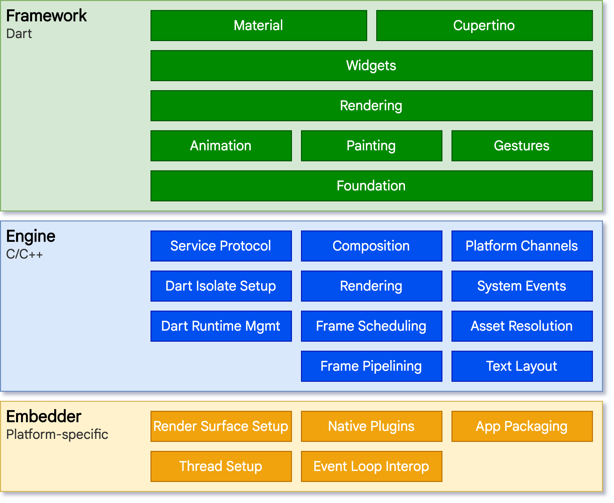
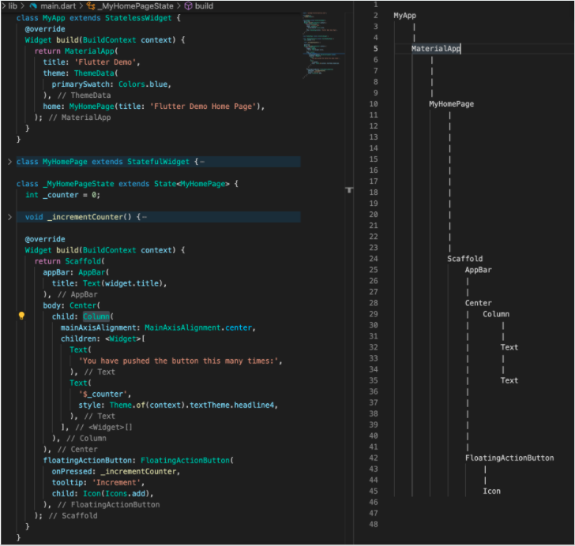
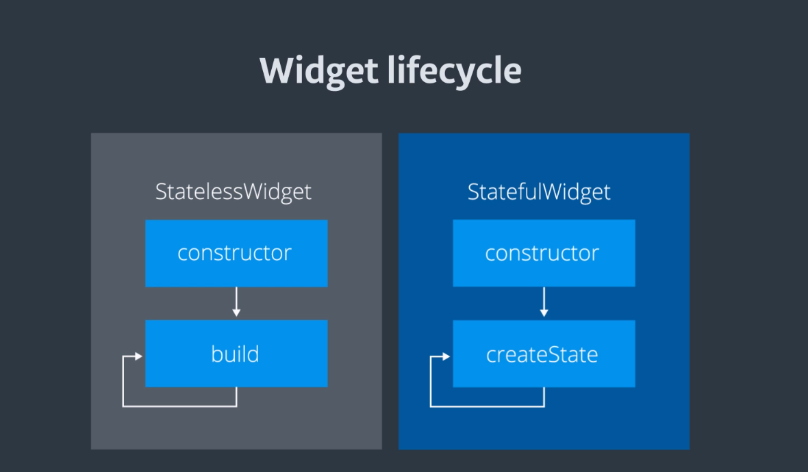
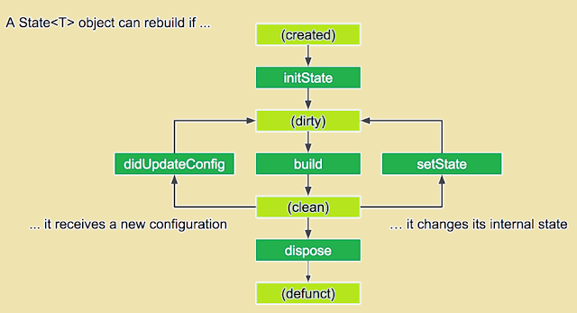

<!--
header: 'created by Lam Nguyen'
-->

# 

Made by **Google**

<!--
footer: ''
-->

---

## 1. What is **Flutter**?

**Flutter** is `Google's UI toolkit` for building beautiful, natively compiled applications for `mobile`, `web`, `desktop`, and `embedded` devices from a single codebase.

<!--
footer: 'https://flutter.dev/'
-->

---

<!--
header: '1. What is Flutter?'
-->

### 1.1. Architectural layers




<!--
footer: 'https://flutter.dev/docs/resources/architectural-overview'
-->

---

<!--
header: '1. What is Flutter?'
-->


<!--
footer: ''
-->

### 1.2. Get started

Get started now?
https://flutter.dev/docs/get-started/install


Coming from another platform?
Docs:
[iOS](https://flutter.dev/docs/get-started/flutter-for/ios-devs), [Android](https://flutter.dev/docs/get-started/flutter-for/android-devs), [Web](https://flutter.dev/docs/get-started/flutter-for/web-devs), [React Native](https://flutter.dev/docs/get-started/flutter-for/react-native-devs) and [Xamarin](https://flutter.dev/docs/get-started/flutter-for/xamarin-forms-devs).

<!--
footer: ''
-->

---

<!--
header: '1. What is Flutter?'
-->

### 1.3. Try Flutter in your browser


```dart
import "package:flutter/material.dart";

void main() {
  runApp(
    const Center(
      child: Text(
        "Hello World!!!",
        textDirection: TextDirection.ltr,
      ),
    ),
  );
}
```

<!--
footer: ''
-->

---

<!--
header: '1. What is Flutter?'
-->

### 1.3. Try Flutter in your browser

<iframe width="100%" height="500px" src="https://dartpad.dev/embed-flutter.html?theme=&amp;null_safety=true&id=9677a59dba30af792ba6d129b8a58f63"></iframe>

<!--
footer: 'https://dartpad.dev/embed-flutter.html?theme=&amp;null_safety=true&id=9677a59dba30af792ba6d129b8a58f63'
-->

---

### 1.4. Who's using Flutter?
Organizations around the world are building apps with Flutter.

| * | * | * |
| :-----------: | :-----------: | :-----------: |
|  |  |  |
|  |  |  |

<!--
footer: ''
-->

---

<!--
header: '1. What is Flutter?'
-->

### 1.4. Who's using Flutter?

See what’s being created:

<iframe width="100%" height="100%" src="https://flutter.dev/showcase"></iframe>

<!--
footer: 'https://flutter.dev/showcase'
-->

---

<!--
header: ''
-->

## 2. User Interface
+ 2.1. Introduction to widgets
+ 2.2. Building layouts
+ 2.3. Adding interactivity
+ 2.4. Assets & images
+ 2.5. Navigation & routing
+ 2.6. Animations
+ 2.7. Advanced UI
+ 2.8. Widget catalog

<!--
footer: ''
-->

---

<!--
header: '2. User Interface'
-->

### 2.1. Introduction to widgets

- Flutter `Widgets` are inspired by React `Components`
- Rendered by their current configuration (or BuildContext) and state
- When state changes, it rebuilds
- the framework diffs against the previous description in order to determine the minimal changes needed

<!--
footer: ''
-->

---

<!--
header: '2. User Interface'
-->

### 2.1. Introduction to widgets

- `Everything` is a `Widget`
  - But don’t put everything in one Widget!
- References:
  - [Everything is a Widget, but don’t put everything in one Widget!](https://romain-rastel.medium.com/everything-is-a-widget-but-dont-put-everything-in-a-widget-32f89b5c8bdb)
  - [Flutter: Extract widget to function or new widget class](https://medium.com/halkbank-mobile-tech/flutter-best-practices-1-d7a0fb1fdb6c)
  - [Splitting widgets to methods is an antipattern](https://iiro.dev/splitting-widgets-to-methods-performance-antipattern/)
  
  
> Everything Should Be Made as Simple as Possible, But Not Simpler

<!--
footer: ''
-->

---

<!--
header: '2. User Interface'
-->

### 2.1. Introduction to widgets

#### Basic widgets:

- [Text](https://api.flutter.dev/flutter/widgets/Text-class.html) - create a run of styled text within your application.
- [Row](https://api.flutter.dev/flutter/widgets/Row-class.html), [Column](https://api.flutter.dev/flutter/widgets/Column-class.html) are flex widgets
- [Stack](https://api.flutter.dev/flutter/widgets/Stack-class.html) - place widgets on top of each other in paint order.
- [Container](https://api.flutter.dev/flutter/widgets/Container-class.html) - create a rectangular visual element, decorated with a background, a border, or a shadow; also have margins, padding, and constraints applied to its size, ...

… more widgets from there: https://api.flutter.dev/flutter/widgets/widgets-library.html

<!--
footer: ''
-->

---

<!--
header: '2. User Interface'
-->

### 2.1. Introduction to widgets

#### Notion of Widgets tree

Widgets are organized in tree structure(s).



<!--
footer: ''
-->

---

<!--
header: '2. User Interface'
-->

### 2.1. Introduction to widgets

#### Notion of Context or BuildContext

Location of a Widget within the tree structure
A context only belongs to one widget.


<!--
footer: 'https://www.didierboelens.com/2018/06/widget-state-context-inheritedwidget/'
-->

---

<!--
header: '2. User Interface'
-->

### 2.1. Introduction to widgets

#### Stateful and stateless widgets (1)

| StatelessWidget | StatefulWidget |
| ----- | ----- |
| Examples:<br/> - [Icon](https://api.flutter.dev/flutter/widgets/Icon-class.html)<br/> - [IconButton](https://api.flutter.dev/flutter/material/IconButton-class.html)<br/> - [Text](https://api.flutter.dev/flutter/widgets/Text-class.html) | Examples:<br/> - [Checkbox](https://api.flutter.dev/flutter/material/Checkbox-class.html)<br/> - [Radio](https://api.flutter.dev/flutter/material/IconButton-class.html)<br/> - [Slider](https://api.flutter.dev/flutter/material/Text-class.html)<br/> - [InkWell](https://api.flutter.dev/flutter/material/Text-class.html)<br/> - [Form](https://api.flutter.dev/flutter/widgets/Text-class.html)<br/> - [TextField](https://api.flutter.dev/flutter/material/Text-class.html)|
| Super-class: [StatelessWidget](https://api.flutter.dev/flutter/widgets/StatelessWidget-class.html) | Super-class: [StatefulWidget](https://api.flutter.dev/flutter/widgets/StatefulWidget-class.html) |

<!--
footer: ''
-->


---

<!--
header: '2. User Interface'
-->

### 2.1. Introduction to widgets

#### Stateful and stateless widgets (2)

| StatelessWidget | StatefulWidget |
| ----- | ----- |
| Not have to care the state | There are some inner data held and may vary during the lifetime of this widget - called a State |

<!--
footer: ''
-->


---

<!--
header: '2. User Interface'
-->

### 2.1. Introduction to widgets

#### Widget’s Lifecycle (1)



<!--
footer: ''
-->


---

<!--
header: '2. User Interface'
-->

### 2.1. Introduction to widgets

#### Widget’s Lifecycle (2)

The life cycle of the StatefulWidget




<!--
footer: 'https://www.developerlibs.com/2019/12/flutter-lifecycle-widgets.html'
-->

---

<!--
header: '2. User Interface'
-->

### 2.1. Introduction to widgets

#### Notion of State

A State defines the `behavioural` part of a StatefulWidget instance.

It holds information aimed at interacting / interferring with the Widget in terms of:
- behaviour
- layout

> Any changes which is applied to a State forces the Widget to rebuild.

<!--
footer: ''
-->

---

<!--
header: '2. User Interface'
-->

### 2.1. Introduction to widgets

#### Relation between a State and a Context

For Stateful widgets, a `State` is associated with a `Context`. This association is permanent and the `State` object will never change its context.

Even if the Widget Context can be moved around the tree structure, the State will remain associated with that context.

When a State is associated with a Context, the State is considered as mounted.

<!--
footer: ''
-->

---

<!--
header: '2. User Interface'
-->

### 2.1. Introduction to widgets

#### Standard Code of A StatelessWidget

<iframe width="100%" height="500px" src="https://dartpad.dev/embed-flutter.html?theme=&amp;null_safety=true&id=e84496279c4f535c42613d827029aad4"></iframe>

<!--
footer: 'https://dartpad.dev/embed-flutter.html?theme=&amp;null_safety=true&id=e84496279c4f535c42613d827029aad4'
-->

---

<!--
header: '2. User Interface'
-->

### 2.1. Introduction to widgets

#### Standard Code of A StatefulWidget

<iframe width="100%" height="500px" src="https://dartpad.dev/embed-flutter.html?theme=&amp;null_safety=true&id=48be1c817d6f84f1cb39f06975bccfc5"></iframe>

<!--
footer: 'https://dartpad.dev/embed-flutter.html?theme=&amp;null_safety=true&id=48be1c817d6f84f1cb39f06975bccfc5'
-->

---

<!--
header: '2. User Interface'
-->

### 2.1. Introduction to widgets

#### Keys

- Use `keys` to control which widgets are `rebuilds`
- For example in builds a list items in ListView:
  - Without `keys`, the item is rebuilt even if it is no longer visible in viewport.
  - By assigning each entry in the list a “semantic” key, only the items visible in the view will be rebuilds.

For more information, see the [Key](https://api.flutter.dev/flutter/widgets/Key-class.html) API.

<!--
footer: ''
-->

---

<!--
header: '2. User Interface'
-->

### 2.1. Introduction to widgets

#### Global keys

- To uniquely identify child widgets.
- Must be globally unique across the entire widget hierarchy.
- Can be used to retrieve the state associated with a widget.

For more information, see the [GlobalKey](https://api.flutter.dev/flutter/widgets/GlobalKey-class.html) API.

<!--
footer: ''
-->

---

<!--
header: '2. User Interface'
-->

### 2.2. Building layouts

- Layouts in Flutter
- Tutorial
- Creating adaptive and responsive apps
- Understanding constraints
- Box constraints


<!--
footer: ''
-->

---

<!--
header: '2. User Interface / 2.2. Building layouts'
-->

#### 2.2.1 Layouts in Flutter

#### Example (1)

| Design | Visual Layout |
| ----- | ----- |
|  |  |

<!--
footer: 'https://flutter.dev/docs/development/ui/layout'
-->

---

<!--
header: '2. User Interface / 2.2. Building layouts'
-->

#### 2.2.1 Layouts in Flutter

##### Example (2)

Widgets Tree


<!--
footer: 'https://flutter.dev/docs/development/ui/layout'
-->

---

<!--
header: '2. User Interface / 2.2. Building layouts'
-->

#### 2.2.1 Layouts in Flutter

##### Design Languages libaries built-in:
- [Material](https://api.flutter.dev/flutter/material/material-library.html) - Google Material Design
- [Cupertino](https://api.flutter.dev/flutter/cupertino/cupertino-library.html) - iOS Design Language

<!--
footer: ''
-->

---

<!--
header: '2. User Interface / 2.2. Building layouts'
-->

#### 2.2.1 Layouts in Flutter

##### Common layout widgets:

Standard widgets

- [Container](https://flutter.dev/docs/development/ui/layout#container): Adds padding, margins, borders, background color, or other decorations to a widget.
- [GridView](https://flutter.dev/docs/development/ui/layout#gridView): Lays widgets out as a scrollable grid.
- [ListView](https://flutter.dev/docs/development/ui/layout#listView): Lays widgets out as a scrollable list.
- [Stack](https://flutter.dev/docs/development/ui/layout#stack): Overlaps a widget on top of another.

<!--
footer: 'https://flutter.dev/docs/development/ui/layout#common-layout-widgets'
-->

---

<!--
header: '2. User Interface / 2.2. Building layouts'
-->

#### 2.2.1 Layouts in Flutter

##### Common layout widgets:

Material widgets
- [Card](https://flutter.dev/docs/development/ui/layout#card): Organizes related info into a box with rounded corners and a drop shadow.
- [ListTile](https://flutter.dev/docs/development/ui/layout#listtile): Organizes up to 3 lines of text, and optional leading and trailing icons, into a row.

<!--
footer: 'https://flutter.dev/docs/development/ui/layout#common-layout-widgets'
-->

---

<!--
header: '2. User Interface / 2.2. Building layouts'
-->

#### 2.2.2 Tutorial

<iframe width="100%" height="500px" src="https://flutter.dev/docs/development/ui/layout/tutorial"></iframe>

<!--
footer: 'https://flutter.dev/docs/development/ui/layout/tutorial'
-->

---

<!--
header: '2. User Interface / 2.2. Building layouts'
-->

#### 2.2.3 Creating adaptive and responsive apps

Difference between Adaptive and Responsive app
- Adaptive and responsive can be viewed as separate dimensions of an app
- Responsive
  - Typically, a responsive app has had its layout tuned for the available screen size...
  - [Create a responsive app](https://flutter.dev/docs/development/ui/layout/adaptive-responsive#creating-a-responsive-flutter-app)
- Adaptive
  - Adapting an app to run on different device types, such as mobile and desktop, requires dealing with mouse and keyboard input, ...
  - [Building adaptive apps](https://flutter.dev/docs/development/ui/layout/building-adaptive-apps)


<!--
footer: 'https://flutter.dev/docs/development/ui/layout/adaptive-responsive'
-->

---

<!--
header: '2. User Interface / 2.2. Building layouts'
-->

#### 2.2.3 Understanding constraints
<iframe width="100%" height="500px" src="https://flutter.dev/docs/development/ui/layout/constraints"></iframe>

<!--
footer: 'https://flutter.dev/docs/development/ui/layout/constraints'
-->

---

<!--
header: '2. User Interface'
-->

### 2.3. Adding interactivity
<iframe width="100%" height="500px" src="https://flutter.dev/docs/development/ui/interactive"></iframe>

<!--
footer: 'https://flutter.dev/docs/development/ui/interactive'
-->

---

<!--
header: '2. User Interface'
-->

### 2.4. Adding assets and images
<iframe width="100%" height="500px" src="https://flutter.dev/docs/development/ui/assets-and-images"></iframe>

<!--
footer: 'https://flutter.dev/docs/development/ui/assets-and-images'
-->

---

<!--
header: '2. User Interface'
-->

### 2.5. Navigation and routing (1)

Two approaches:
- Imperative approach, Navigation v1.0
  - see the [Navigation recipes](https://flutter.dev/docs/cookbook/navigation)
  - Or using [Fluro](https://pub.dev/packages/fluro) package
- Declarative approach, Navigation v2.0
  - [Learning Flutter’s new navigation and routing system](https://medium.com/flutter/learning-flutters-new-navigation-and-routing-system-7c9068155ade)
  - Alternate packages:
    - [vrouter](https://pub.dev/packages/vrouter)
    - [beamer](https://pub.dev/packages/beamer) (not stable)

<!--
footer: 'https://flutter.dev/docs/development/ui/layout/adaptive-responsive'
-->

---

<!--
header: '2. User Interface'
-->

### 2.5. Navigation and routing (2)

**Deep linking**:
- Examples:
  - `http://flutterbooksample.com/book/1`
  - `customscheme://flutterbooksample.com/book/1`

**URL strategy on the web**
- Hash (default)
For example, `flutterexample.dev/#/path/to/screen`.
- Path
For example, `flutterexample.dev/path/to/screen`.

<!--
footer: 'https://flutter.dev/docs/development/ui/layout/adaptive-responsive'
-->

---

<!--
header: '2. User Interface'
-->

### 2.5. Navigation and routing (3)

#### [Fluro](https://pub.dev/packages/fluro)
- Simple route navigation
- Function handlers (map to a function instead of a route)
- Wildcard parameter matching
- Querystring parameter parsing
- Common transitions built-in
- Simple custom transition creation
- Follows stable Flutter channel
- Null-safety


<!--
footer: 'https://pub.dev/packages/fluro'
-->

---

<!--
header: '2. User Interface'
-->

### 2.5. Navigation and routing (4)

#### [VRouter](https://pub.dev/packages/vrouter) (for reference only)
- Automated web url handling
- Nesting routes
- Transition
- Advanced url naming
- Reacting to route changing
- Customizable pop events
- And much more...

<!--
footer: 'https://pub.dev/packages/vrouter'
-->

---

<!--
header: '2. User Interface'
-->

### 2.6. Animations

**Approaches:**
- [Implicit Animations](https://flutter.dev/docs/development/ui/animations/implicit-animations)
- [Explicit Animations](https://flutter.dev/docs/codelabs/explicit-animations)
- Low-Level Animation
  - draw it with canvas via [CustomPainter](https://api.flutter.dev/flutter/rendering/CustomPainter-class.html)
- Third-party animation framework
  - [flare_flutter](https://pub.dev/packages/flare_flutter)
  - [lottie](https://pub.dev/packages/lottie)

<!--
footer: 'https://flutter.dev/docs/development/ui/animations#choosing-an-approach'
-->

---

<!--
header: '2. User Interface'
-->

### 2.6. Animations


Full picture: [Click here](https://flutter.dev/assets/images/docs/ui/animations/animation-decision-tree.png)
Video: [How to choose which Flutter Animation Widget is right for you?](https://www.youtube.com/watch?v=GXIJJkq_H8g)


<!--
footer: 'https://flutter.dev/docs/development/ui/animations#choosing-an-approach'
-->

---

<!--
header: '2. User Interface'
-->

### 2.6. Animations

[Common animation patterns](https://flutter.dev/docs/development/ui/animations#common-animation-patterns)
- Animated list or grid
- Shared element transition
  - Shared element transitions between routes (pages)
  - [Hero animations](https://flutter.dev/docs/development/ui/animations/hero-animations)
- [Staggered animation](https://flutter.dev/docs/development/ui/animations/staggered-animations)
  - Animations that are broken into smaller motions, where some of the motion is delayed.
  - The smaller animations might be sequential, or might partially or completely overlap.

<!--
footer: 'https://flutter.dev/docs/development/ui/animations#choosing-an-approach'
-->

---

<!--
header: '2. User Interface'
-->

### 2.7. Advanced UI

- Using Actions and Shortcuts
- Gestures
- Slivers
- Splash screens

<!--
footer: ''
-->

---

<!--
header: '2. User Interface'
-->

### 2.8. Widget catalog


<iframe width="100%" height="500px" src="https://flutter.dev/docs/development/ui/widgets"></iframe>

<!--
footer: 'https://flutter.dev/docs/development/ui/widgets'
-->

---

<!--
header: ''
-->

## 3. State management
- 3.1. [Introduction](https://flutter.dev/docs/development/data-and-backend/state-mgmt/intro)
- 3.2. [Think declaratively](https://flutter.dev/docs/development/data-and-backend/state-mgmt/declarative)
- 3.3. [Ephemeral vs app state](https://flutter.dev/docs/development/data-and-backend/state-mgmt/ephemeral-vs-app)
- 3.4. [Simple app state management](https://flutter.dev/docs/development/data-and-backend/state-mgmt/simple)
- 3.5. [Options](https://flutter.dev/docs/development/data-and-backend/state-mgmt/options)
- 3.6. [Riverpod](https://riverpod.dev/)

<!--
footer: ''
-->

---

<!--
header: ''
-->

## 4. Data & Networking
- 3.1. Cross-platform http networking
- 3.2. [Networking cookbook](https://flutter.dev/docs/cookbook#networking)
- 3.3. [JSON and serialization](https://flutter.dev/docs/development/data-and-backend/json)
- 3.4. OpenAPI and generate Data Provider
- 3.5. [Firebase](https://flutter.dev/docs/development/data-and-backend/firebase)

<!--
footer: ''
-->

---

<!--
header: ''
-->

## 5. Internationalization

<iframe width="100%" height="500px" src="https://flutter.dev/docs/development/accessibility-and-localization/internationalization"></iframe>

<!--
footer: 'https://flutter.dev/docs/development/accessibility-and-localization/internationalization'
-->

---

<!--
header: 'created by Lam Nguyen'
-->

## Other References and ebooks (1)
- Flutter Complete Reference
  - Offical website: https://fluttercompletereference.com/
  - [Full version](https://tedu.edu.vn/public/storage/frontend/tedu-edu-vn/ckeditor/files/ebook/Flutter%20Complete%20Reference_%20Create%20Beautiful%2C%20Fast%20and%20Native%20Apps%20for%20Any%20Device.pdf)
  - [Preview version](https://fluttercompletereference.com/preview/flutter_reference.pdf)
- Performance & optimization
  - [App Size](https://flutter.dev/docs/perf/app-size)
  - [Deferred components](https://flutter.dev/docs/perf/deferred-components)
- [Platform-specific behaviors and adaptations](https://flutter.dev/docs/resources/platform-adaptations)

<!--
footer: ''
-->

---

<!--
header: 'created by Lam Nguyen'
-->

## Other References and ebooks (2)
- [Widget index](https://flutter.dev/docs/reference/widgets)
- [API reference](https://api.flutter.dev/)
- [flutter CLI reference](https://flutter.dev/docs/reference/flutter-cli)
- [Package site](https://pub.dev/flutter)
- [FAQ](https://flutter.dev/docs/resources/faq)

<!--
footer: ''
-->

---

<div style="
  font-size: 48px;
  text-align: center;
">
  Thank you
</div>